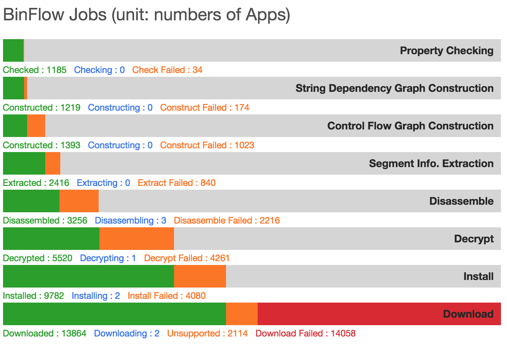

# BinFlow: Static Detection of API Call Vulnerabilities in iOS Executables

# Reference

Chun-Han Lin, Fang Yu, Jie-Hong Jiang, and Tevfik Bultan.   
“Poster: Static Detection of API Call Vulnerabilities in iOS Executables.”   
The 40th International Conference on Software Engineering (ICSE’18), May 27 - 3 June 2018, Gothenburg, Sweden. [link](https://www.icse2018.org/event/icse-2018-posters-poster-static-detection-of-api-call-vulnerabilities-in-ios-executables)

# Binflow



---

## About 

This GitHub provides the scripts and the configure file to run Binflow that combines static flow analysis and string analysis to detect API call vulnerabilities in iOS executables.

* The Binflow Analyzer
	
	The scripts in the BinFlowAnalyzer folder can be used to reproduce our analysis results.  Below is the step to start Binflow for the control flow analysis and dependency analysis on iOS executables. 
	To clone binflow scripts, the command is:
	
	```sh
	git clone https://github.com/soslab-nccu/binflow.git
	```
	Under the folder binflow, the help command shows how to execute each part of our analysis:

	```sh
	./BinFlowAnalyzer/bin/binflow -h
	
	usage: binflow
	 -c,--cfg <arg>       generate control-flows graph from json file
	 -C,--charset <arg>   charset, default is utf-8
	 -d,--dpg <arg>       dependency graph from cfg
	 -g                   output as Graphviz *.dot graph format
	 -h,--hint <arg>      draw call hint edge on graph
	 -o,--output <arg>    specific output file path
	 -p,--preproc <arg>   preprocess assembly to json file
	 -P,--propchk <arg>   check property violate from dependency graph
 	```
 
Binflow contains five parts:

---

## Preprocess: Download, Install, Decrypt and Disassemble

We first download and install online apps from Apple's app store
into a jail-broken iOS device, where we can access the file system directly
to fetch the target binary. The binary is encrypted and it is decrypted by the
device with authentication upon execution. To decrypt the binary, we apply the third party binary decryption tool (Dynist: Tools for binary instrumentation, analysis,
and modification. https://github.com/dyninst.) to generate the decrypted binary. The decrypted binary can then be analyzed with disassembler tools. We use the IDA tool (IDAPro. https://www.hex-rays.com/products/ida) to generate the plain text format assembly code. 
 
Here is a sample of [decrypted assembly app](http://140.119.19.229:7777/apps/219?type=binflow.could-load-private-class). We will use this app as an example to construct the result of each step of our BinFlow analysis.


---

## Segment Information Extraction

An iOS app’s binary is a Mach Object (Mach-O), and its assembly is split into multiple segments containing various meta information such as subroutine entries, external calls, constant strings, mapping tables, etc., in addition to the assembly body of its subroutines. We extract needed information from assembly segments including all subroutines and constants so that we have sufficient information to resolve register values of indirect jumps to link these routines in the next step.

### Example   
Here is a sample result of [Segment Information Extraction](https://drive.google.com/drive/folders/1CssC8WGK-sDa8J6LXe7NmzI6mgytN25r?usp=sharing)

### Command

```
./BinFlowAnalyzer/bin/binflow -p ./testSink/1212123.bin.asm
```

### Input
A decripted assembly:

1. {Serial id}.asm


### Output 
The output of segment information extraction contains 1) 14 segment files, each corresponding to an extracted segment in the assembly. The formal definition for each segment can be refered to Ref: https://www.hex-rays.com/products/decompiler/manual/tricks.shtml. 2) a json file that integrates all the information we need for the following analysis

1. .objcClassList: the __objc_classlist section 
2. .bss: the bss section 
3. .objcClassRefs: the __objc_classrefs section
4. .cfString: the __cfstring section (constant strings that are used in the assembly)
5. .objcConst: the __objc_const section
6. .cString: the __cstring section
7. .objcMethType: the __objc_methtype section
8. .import: the __import section       
9. .objcProtoList: the __objc_protolist section      
10. .objcSelRefs: the __objc_selrefs section
11. .lazySymbol: __la_symbol_ptr
12. .objcSuperRefs: the __objc_superrefs section
13. .nlSymbolPtr: the  __nl_symbol_ptr section  
14. .text: the text section (sub routines)
15. {Serial id}.asm.json file 


---

## Control Flow Graph Construction

Our goal is to construct the control flow graph (CFG) for each subroutine, and resolve register values of indirect jumps to link these routines. During the CFG construction, we also mark dependency relations of registers for each assembly statement. To identify sensitive functions, we also record call-external-C-function-node or call-external-method-node and resolve their register values to identify which ones are relevant to the target (sensitive) function. 


### Example  

Here is a sample result of [Control Flow Graph](https://drive.google.com/drive/folders/1-OzaXvSFnUzi2z7KqI4ds9vWOjnvHguY?usp=sharing)

### Command

```
./BinFlowAnalyzer/bin/binflow -c ./testSink/1212123.bin.asm.json -g 
```

### Input

A json file that integrates the extracted segment infomration of an assembly

1. {Serial id}.asm.json

### Output

The outputs of cfg are in two formats: 1) an internal format that serializes the cfg objects in binflow and 2) a dot format to generate a visualized figure [Graphviz](https://www.graphviz.org/)

1. {Serial id}.asm.json.cfg
2. {Serial id}.asm.json.cfg.dot

---

## String Dependency Graph Construction

When a sensitive function is identified, we then build the dependency graphs for its parameters. This can be done by traversing the dependency relations from the corresponding register (sink) backwards up to constants or external inputs. For each sink, we build its string dependency graph that specifies how input values flow to the sink. The sink values define the values of the parameters of target functions. 

In our current implementation, we support two sensitive functions: 1) NSClassFromString and 2) BundleWithPath.

### Example 

Here is a sample result of [String Dependency Graph Result](https://drive.google.com/drive/folders/11VlrlRPuCAAi8Fhg2wBf-BjdFHXq5Hnc?usp=sharing)

### Command

To generate string dependency graphs for dynamically loaded class (NSClassFromString):

```
./BinFlowAnalyzer/bin/binflow -d ./testSink/1212123.bin.asm.json.cfg -s NSClassFromString

```

To generate string dependency graphs for dynamically loaded path (BundleWithPath):

```
./BinFlowAnalyzer/bin/binflow -d ./testSink/1212123.bin.asm.json.cfg -s BundleWithPath

```

### Input 

A binflow internal file that serializes cfg objects of the assembly

1. {Serial id}.asm.json.cfg

### Output 

The outputs of sdgs are in two formats: 1) an internal format for string analyis and 2) a dot format to generate a visualized figure 

1. {app_id}.asm. json.cfg.dep.___imp__{NSClassFromString/BundleWithPath}_{dep_id}.dep
2. {app_id}.asm.json.cfg.dep.___imp__ {NSClassFromString/BundleWithPath}_{dep_id}.dot


---

## Property Checking

For policy checking, we conduct forward string analysis on the graph to characterize all potential string values at the sink node. We adopt automata-based string analysis where the automata associated with the sink node accepts all possible string values that can reach the sink node. We start from constants and arbitrary values of external inputs and propagate string values through string operations using automata constructions until a fixpoint is reached at the sink node of the dependency graph. The automata are then used to determine all the dynamic loaded classes and invoked methods.

In our current implementation, we check whether the automata that characterize the set of dynamically loaded classes (or paths) has a non-empty intersection with automata that characterize sensitive/private API call violations (specified as regular expressions).

### Input 

A binflow internal file for string dependency graph

1. {app_id}.asm.json.cfg.dep.\_\_\_imp\_\_\_{NSClassFromString/bundleWithPath}_{dep_id}.dep

### Command and Output

To check whether the chacterized automata of a given sdg has intersection with private API calls:

```sh
./BinFlowAnalyzer/bin/binflow -P ./testSink/1212123.bin.asm.json.cfg.dep___imp__NSClassFromString_1023.dep -s PrivateClass

#Result
Check DepProp id 1212123.bin.asm.json.cfg.dep___imp__NSClassFromString_1023.dep completed
The result for check: true

```


To check whether the chacterized automata of a given sdg has intersection with IDFA API calls (ASIdentifierManager):

```sh
./BinFlowAnalyzer/bin/binflow -P ./testSink/1212123.bin.asm.json.cfg.dep___imp__NSClassFromString_1023.dep -s IDFA

#Result
Check DepProp id 1212123.bin.asm.json.cfg.dep___imp__NSClassFromString_1023.dep completed
The result for check: false
```


To check whether the chacterized automata of a given sdg has intersection with private API paths:

```sh
./BinFlowAnalyzer/bin/binflow -P ./testSink/1212123.bin.asm.json.cfg.dep_bundleWithPath_1351.dep -s BundlePrivateClass

#Result
Check DepProp id 1212123.bin.asm.json.cfg.dep_bundleWithPath_1351.dep completed
The result for check: true
```


---

# Public iOS App Analysis Results 

We have sucessfully analyzed more than a thousand online iOS apps from Apple's App Store. For each app, we construct its decrpted assembly, segment information extractions, cfgs, sdgs, and check all the three properties. 

### App Analysis Example 

Here is a sample result of our analysis on an online app [Property Checking](http://140.119.19.229:7777/apps/1304)  

The violations of the app are listed as: 

* PrivateClass Violations
	* 47404(0)  
Expression: unknown("COULD_BE_EXTERN_METHOD_RETURN_VALUE","-[NSEntityDescription managedObjectClassName]",801990210) 
	* 47422(0)
Expression: unknown("COULD_BE_EXTERN_METHOD_RETURN_VALUE","-[NSEntityDescription managedObjectClassName]",801988416)   
	...

* bundlePath Violations
	* 47438(0)
Expression: deleteLastPathComponent(unknown("NO_CALLER_CALL_TO_SUBROUTINE","sub_4BADDC",800476409))
	* 47433(0)
Expression: unknown("COULD_BE_EXTERN_METHOD_RETURN_VALUE","+[NSBundle pathForResource:ofType:]",802298834) 

* iDFAClass Violations
	* 55002(0)
Expression: concat("ASI","dentif","ierManager") 
	* 54883(0)
Expression: "ASIdentifierManager"  
	* 47405(0)
Expression: unknown("COULD_BE_EXTERN_METHOD_RETURN_VALUE","-[NSEntityDescription managedObjectClassName]",801990210)     
	...
	
### Website and Data

* [Binflow Analysis Report Website](http://140.119.19.90:7777/binflow/NSClassFromString)

* [The Generated Assembly, CFGs, SDGs of Some Sampled Apps](http://140.119.19.247:10988/s/DvFqqO9bTiPx5LC)  
The folder consists of several analyzed apps with their extracted segment information (in a json format), control flow graphs (in the dot format), and dependency graphs (in the dot format). More data are avalbale upon request. 

* [The Generated JSON Files(Extracted segment information)](http://soslab.nccu.edu.tw/binflowjson)  
